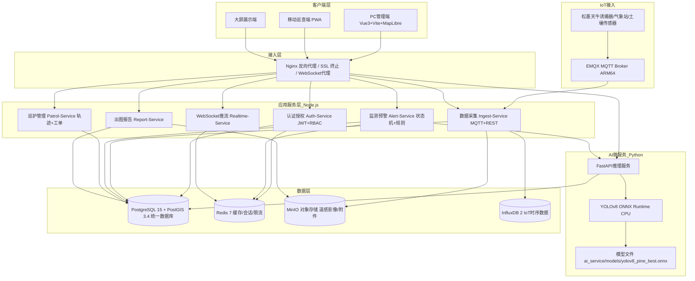
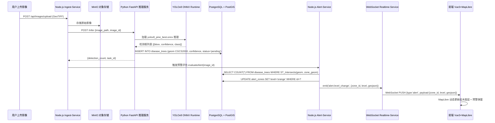
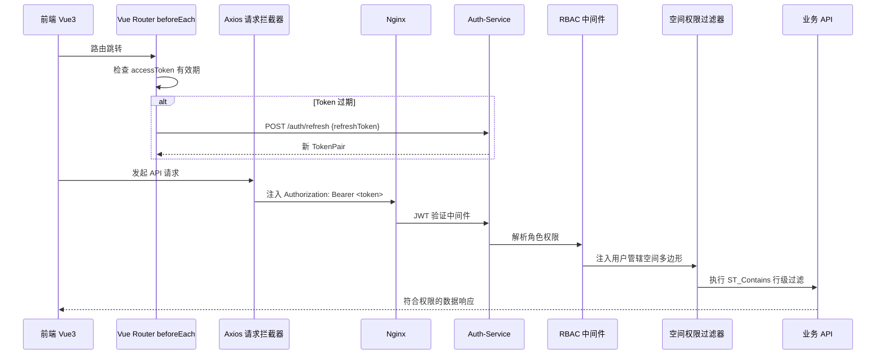

# Design Document: 「松海护航」松材线虫监测预警平台

## Overview

「松海护航」是一套面向林业主管部门、护林员、科研院所、政府部门和保险公司的全栈 Web GIS 监测预警平台。系统以空天地一体化数据采集为基础，融合深度学习遥感识别（YOLOv8 ONNX CPU推理）、RBAC 空间权限管控、多门户协同和全链条业务闭环，最终容器化部署于 ARM64 纯 CPU 架构服务器。

**第一阶段范围**：聚焦林业局/林场的监测预警核心流程、空间态势大屏及 RBAC 权限管控。

**关键架构决策（已确认）**：
- 后端：Node.js（Express + TypeScript）负责业务编排；Python（FastAPI）独立微服务负责 ONNX 推理
- AI 模型：本地 RTX 3060 训练 YOLOv8，导出 `.onnx` 文件上传至 `ai_service/models/yolov8_pine_best.onnx`，服务器端仅做 ONNX Runtime CPU 推理
- 数据库：全栈统一 PostgreSQL + PostGIS，废弃 MySQL 双库方案
- 工作流：第一阶段用 Node.js 状态机 + 数据库状态字段，不引入 Camunda
- 部署：ARM64 纯 CPU，无 GPU

---

## Architecture

### 系统总体架构



### 核心数据流：AI 识别结果落库与实时推送



### JWT 认证与 RBAC 鉴权流程



---

## Components and Interfaces

### Auth-Service（认证授权）

```typescript
// POST /auth/login
interface LoginRequest {
  username: string
  password: string  // bcrypt 哈希后传输
  clientType: 'pc' | 'mobile' | 'bigscreen'
}

interface TokenPair {
  accessToken: string   // JWT, 15min 有效期
  refreshToken: string  // 7天有效期, 存 Redis blacklist
  expiresIn: number
}

// POST /auth/refresh
interface RefreshRequest { refreshToken: string }

// 前端路由守卫
router.beforeEach(async (to, from, next) => {
  const token = useAuthStore().accessToken
  if (!token && to.meta.requiresAuth) {
    return next('/login')
  }
  if (isTokenExpired(token)) {
    await authStore.silentRefresh()  // 静默刷新
  }
  next()
})
```

### RBAC-Service（权限管控）

```typescript
interface PermissionSet {
  menuIds: string[]
  apiRoutes: string[]
  spatialBoundary: GeoJSON.Polygon | null  // null = 全域权限
  dataLevel: 'L1' | 'L2' | 'L3'
  roles: ('admin' | 'forest_manager' | 'patrol_officer' | 'analyst' | 'viewer')[]
}

// 空间权限中间件（Node.js Express）
const spatialPermissionMiddleware = async (req, res, next) => {
  const userBoundary = req.user.spatialBoundary
  if (userBoundary) {
    req.spatialFilter = `ST_Contains(ST_GeomFromGeoJSON('${JSON.stringify(userBoundary)}'), geom)`
  }
  next()
}
```

### AI 推理服务（Python FastAPI）

```python
# ai_service/main.py
from fastapi import FastAPI
import onnxruntime as ort

app = FastAPI()

# 模型文件位置（用户上传 .onnx 文件到此路径）
MODEL_PATH = "ai_service/models/yolov8_pine_best.onnx"

@app.post("/infer")
async def infer(request: InferRequest) -> InferResponse:
    """
    Preconditions:
      - request.image_path 指向 MinIO 中的有效 GeoTIFF 文件
      - MODEL_PATH 存在且为有效 YOLOv8 ONNX 模型
    Postconditions:
      - 返回检测结果列表，confidence >= 0.5 的结果写入 PostGIS
      - 坐标已转换为 CGCS2000 (EPSG:4490)
    """
    session = ort.InferenceSession(MODEL_PATH, providers=['CPUExecutionProvider'])
    # ... 推理逻辑
    return InferResponse(detections=results, task_id=task_id)

@app.get("/health")
async def health():
    return {"status": "ok", "model_loaded": os.path.exists(MODEL_PATH)}
```

### Alert-Service（监测预警状态机）

```typescript
// 灾情等级状态机（替代 Camunda）
type AlertLevel = 'green' | 'yellow' | 'orange' | 'red'

const ALERT_RULES = {
  green:  { maxCount: 0,   maxArea: 0 },
  yellow: { maxCount: 5,   maxArea: 0.5 },   // 公顷
  orange: { maxCount: 20,  maxArea: 2.0 },
  red:    { maxCount: 100, maxArea: 10.0 },
}

async function evaluateAlertLevel(zoneId: string): Promise<AlertLevel> {
  const { count, area } = await db.query(
    `SELECT COUNT(*) as count, SUM(ST_Area(geom::geography)/10000) as area
     FROM disease_trees
     WHERE ST_Intersects(geom, (SELECT geom FROM alert_zones WHERE id=$1))
     AND status != 'false_positive'`,
    [zoneId]
  )
  // 状态机转换逻辑
  if (count >= 100 || area >= 10) return 'red'
  if (count >= 20  || area >= 2)  return 'orange'
  if (count >= 5   || area >= 0.5) return 'yellow'
  return 'green'
}
```

### Realtime-Service（WebSocket 推流）

```typescript
interface WSMessage {
  type: 'alert.new' | 'alert.level_change' | 'patrol.track' | 'workorder.update' | 'iot.heartbeat'
  priority: 'critical' | 'high' | 'normal' | 'low'
  payload: unknown
  timestamp: string
}

// 主题订阅规范
const WS_TOPICS = {
  ALERT_NEW:       'alert.new_detection',
  ALERT_LEVEL:     'alert.level_change',
  PATROL_TRACK:    'patrol.track_update',
  WORKORDER:       'workorder.status_change',
  IOT_HEARTBEAT:   'iot.device_heartbeat',
} as const
```

---

## Data Models

### PostgreSQL + PostGIS 统一数据库（核心表）

```sql
-- ============================================================
-- 用户与权限体系
-- ============================================================
CREATE TABLE users (
    id              UUID PRIMARY KEY DEFAULT gen_random_uuid(),
    username        VARCHAR(50) UNIQUE NOT NULL,
    password_hash   VARCHAR(255) NOT NULL,  -- bcrypt
    email           VARCHAR(100),
    phone           VARCHAR(20),
    status          VARCHAR(20) DEFAULT 'active',  -- active/frozen/archived
    spatial_boundary GEOMETRY(Polygon, 4490),       -- 管辖空间范围，NULL=全域
    data_level      SMALLINT DEFAULT 1,             -- 1:L1 2:L2 3:L3
    created_at      TIMESTAMPTZ DEFAULT NOW()
);

CREATE TABLE roles (
    id          UUID PRIMARY KEY DEFAULT gen_random_uuid(),
    name        VARCHAR(50) UNIQUE NOT NULL,  -- admin/forest_manager/patrol_officer/analyst/viewer
    description TEXT,
    is_temp     BOOLEAN DEFAULT FALSE,
    expires_at  TIMESTAMPTZ
);

CREATE TABLE user_roles (
    user_id     UUID REFERENCES users(id) ON DELETE CASCADE,
    role_id     UUID REFERENCES roles(id) ON DELETE CASCADE,
    granted_at  TIMESTAMPTZ DEFAULT NOW(),
    granted_by  UUID REFERENCES users(id),
    PRIMARY KEY (user_id, role_id)
);

CREATE TABLE permissions (
    id              UUID PRIMARY KEY DEFAULT gen_random_uuid(),
    role_id         UUID REFERENCES roles(id) ON DELETE CASCADE,
    resource_type   VARCHAR(50) NOT NULL,  -- 'menu'/'api'/'data'
    resource_key    VARCHAR(100) NOT NULL,
    action          VARCHAR(20) NOT NULL   -- 'read'/'write'/'delete'/'export'
);

-- ============================================================
-- 空间核心数据
-- ============================================================
CREATE TABLE forest_farms (
    id          UUID PRIMARY KEY DEFAULT gen_random_uuid(),
    name        VARCHAR(100) NOT NULL,
    admin_code  VARCHAR(20) NOT NULL,
    geom        GEOMETRY(Polygon, 4490) NOT NULL,
    created_at  TIMESTAMPTZ DEFAULT NOW()
);
CREATE INDEX idx_forest_farms_geom ON forest_farms USING GIST(geom);

CREATE TABLE forest_plots (
    id              UUID PRIMARY KEY DEFAULT gen_random_uuid(),
    plot_code       VARCHAR(50) UNIQUE NOT NULL,
    geom            GEOMETRY(Polygon, 4490) NOT NULL,
    area_ha         FLOAT NOT NULL,
    tree_species    VARCHAR(100),
    admin_code      VARCHAR(20) NOT NULL,
    forest_farm_id  UUID REFERENCES forest_farms(id),
    risk_level      SMALLINT DEFAULT 0,  -- 0:无 1:低 2:中 3:高 4:极高
    created_at      TIMESTAMPTZ DEFAULT NOW()
);
CREATE INDEX idx_forest_plots_geom ON forest_plots USING GIST(geom);

CREATE TABLE disease_trees (
    id              UUID PRIMARY KEY DEFAULT gen_random_uuid(),
    geom            GEOMETRY(Point, 4490) NOT NULL,
    confidence      FLOAT NOT NULL CHECK (confidence BETWEEN 0 AND 1),
    class_label     VARCHAR(50) NOT NULL,  -- 'dead_tree'/'discolored'/'suspected'
    severity        SMALLINT DEFAULT 1,    -- 1:轻 2:中 3:重
    image_id        UUID,
    detected_at     TIMESTAMPTZ NOT NULL DEFAULT NOW(),
    verified_by     UUID REFERENCES users(id),
    verified_at     TIMESTAMPTZ,
    status          VARCHAR(20) DEFAULT 'pending',  -- pending/confirmed/false_positive/cleared
    forest_plot_id  UUID REFERENCES forest_plots(id),
    created_at      TIMESTAMPTZ DEFAULT NOW()
);
CREATE INDEX idx_disease_trees_geom ON disease_trees USING GIST(geom);
CREATE INDEX idx_disease_trees_detected_at ON disease_trees(detected_at DESC);
CREATE INDEX idx_disease_trees_status ON disease_trees(status);

CREATE TABLE alert_zones (
    id              UUID PRIMARY KEY DEFAULT gen_random_uuid(),
    name            VARCHAR(100),
    geom            GEOMETRY(Polygon, 4490) NOT NULL,
    level           VARCHAR(10) NOT NULL DEFAULT 'green',  -- green/yellow/orange/red
    disease_count   INTEGER DEFAULT 0,
    affected_area   FLOAT DEFAULT 0,
    triggered_at    TIMESTAMPTZ NOT NULL DEFAULT NOW(),
    resolved_at     TIMESTAMPTZ,
    status          VARCHAR(20) DEFAULT 'active',
    forest_farm_id  UUID REFERENCES forest_farms(id)
);
CREATE INDEX idx_alert_zones_geom ON alert_zones USING GIST(geom);

-- ============================================================
-- 遥感影像元数据
-- ============================================================
CREATE TABLE remote_sensing_images (
    id              UUID PRIMARY KEY DEFAULT gen_random_uuid(),
    filename        VARCHAR(255) NOT NULL,
    minio_path      VARCHAR(500) NOT NULL,
    source_type     VARCHAR(50),  -- 'satellite_gf2'/'satellite_gf7'/'sentinel2'/'uav_dom'
    resolution_m    FLOAT,
    cloud_cover     FLOAT,
    captured_at     TIMESTAMPTZ,
    bbox            GEOMETRY(Polygon, 4490),
    crs_epsg        INTEGER DEFAULT 4490,
    ndvi_path       VARCHAR(500),  -- NDVI GeoTIFF 存储路径
    lai_path        VARCHAR(500),  -- LAI GeoTIFF 存储路径
    sr_path         VARCHAR(500),  -- SR (Simple Ratio) GeoTIFF 存储路径
    status          VARCHAR(20) DEFAULT 'uploaded',  -- uploaded/preprocessing/ready/inferred
    created_at      TIMESTAMPTZ DEFAULT NOW()
);
CREATE INDEX idx_rsi_bbox ON remote_sensing_images USING GIST(bbox);

-- ============================================================
-- 巡查与工单
-- ============================================================
CREATE TABLE work_orders (
    id              UUID PRIMARY KEY DEFAULT gen_random_uuid(),
    type            VARCHAR(50) NOT NULL,  -- 'patrol'/'treatment'/'verification'
    status          VARCHAR(20) DEFAULT 'pending',  -- pending/assigned/in_progress/completed/cancelled
    priority        SMALLINT DEFAULT 2,    -- 1:低 2:中 3:高 4:紧急
    assignee_id     UUID REFERENCES users(id),
    alert_zone_id   UUID REFERENCES alert_zones(id),
    deadline        TIMESTAMPTZ,
    description     TEXT,
    evidence_urls   JSONB,  -- 现场照片/视频 MinIO 路径数组
    created_at      TIMESTAMPTZ DEFAULT NOW(),
    updated_at      TIMESTAMPTZ DEFAULT NOW()
);

CREATE TABLE patrol_tracks (
    id              UUID PRIMARY KEY DEFAULT gen_random_uuid(),
    user_id         UUID NOT NULL REFERENCES users(id),
    workorder_id    UUID REFERENCES work_orders(id),
    track           GEOMETRY(LineString, 4490),
    raw_points      JSONB,
    started_at      TIMESTAMPTZ NOT NULL,
    ended_at        TIMESTAMPTZ,
    distance_km     FLOAT,
    created_at      TIMESTAMPTZ DEFAULT NOW()
);
CREATE INDEX idx_patrol_tracks_geom ON patrol_tracks USING GIST(track);

-- ============================================================
-- IoT 设备
-- ============================================================
CREATE TABLE iot_devices (
    id              UUID PRIMARY KEY DEFAULT gen_random_uuid(),
    device_code     VARCHAR(100) UNIQUE NOT NULL,
    device_type     VARCHAR(50),  -- 'trap'/'weather'/'soil'
    geom            GEOMETRY(Point, 4490),
    status          VARCHAR(20) DEFAULT 'online',  -- online/offline/fault
    battery_pct     FLOAT,
    last_heartbeat  TIMESTAMPTZ,
    forest_farm_id  UUID REFERENCES forest_farms(id),
    created_at      TIMESTAMPTZ DEFAULT NOW()
);
CREATE INDEX idx_iot_devices_geom ON iot_devices USING GIST(geom);

-- ============================================================
-- 审计日志
-- ============================================================
CREATE TABLE audit_logs (
    id          BIGSERIAL PRIMARY KEY,
    user_id     UUID REFERENCES users(id),
    action      VARCHAR(100) NOT NULL,
    resource    VARCHAR(100),
    ip_address  INET,
    user_agent  TEXT,
    payload     JSONB,
    hash        VARCHAR(64),  -- SHA-256 链式哈希
    prev_hash   VARCHAR(64),
    created_at  TIMESTAMPTZ DEFAULT NOW()
);
```

---

## Correctness Properties

以下属性通过属性测试（fast-check / Hypothesis）验证：

### Property 1: 空间权限隔离

对任意用户 U（`spatial_boundary != NULL`）和任意坐标点 P，若 `ST_Contains(U.spatial_boundary, P) = false`，则所有返回给 U 的 `disease_trees` 记录中不存在 P。

### Property 2: 预警等级单调性

对任意预警区域 Z，若 `disease_count(Z, t2) > disease_count(Z, t1)`，则 `alert_level(Z, t2) >= alert_level(Z, t1)`（等级不降低）。

### Property 3: JWT 无状态性

对任意有效 Token T，`verifyToken(T)` 的结果仅依赖 T 本身和密钥，不依赖数据库状态（Redis 黑名单除外）。

### Property 4: ONNX 推理确定性

对相同输入图像 I 和相同模型权重，`infer(I)` 的输出结果在多次调用间保持一致（deterministic）。

### Property 5: 坐标系一致性

所有写入 PostGIS 的几何对象 SRID 必须为 4490，前端展示时动态转换为 4326，不存在 SRID 混用。

---

## Error Handling

| 异常类型 | HTTP 状态码 | 错误码 | 处理策略 |
|---------|------------|--------|---------|
| 认证失败 | 401 | `AUTH_FAILED` | 前端静默刷新 Token，失败则跳转登录 |
| Token 过期 | 401 | `TOKEN_EXPIRED` | Axios 拦截器自动调用 `/auth/refresh` |
| 权限不足 | 403 | `FORBIDDEN` | 返回详细权限缺失说明 |
| 空间越权 | 403 | `SPATIAL_FORBIDDEN` | 返回 `{code, message, allowedBoundary}` |
| 资源不存在 | 404 | `NOT_FOUND` | 标准 404 |
| 业务规则违反 | 422 | `VALIDATION_ERROR` | 返回字段级错误列表 |
| AI 模型未加载 | 503 | `MODEL_NOT_READY` | 返回 `{code, modelPath}` 提示上传模型文件 |
| 服务不可用 | 503 | `SERVICE_UNAVAILABLE` | 熔断降级，返回缓存数据 |

```typescript
// 统一错误响应格式
interface ErrorResponse {
  code: string
  message: string
  traceId: string
  timestamp: string
  details?: unknown
}

// Node.js 全局异常中间件
app.use((err: AppError, req: Request, res: Response, next: NextFunction) => {
  const statusCode = err.statusCode ?? 500
  logger.error({ traceId: req.traceId, path: req.path, error: err.message })
  res.status(statusCode).json({
    code: err.code ?? 'INTERNAL_ERROR',
    message: err.message,
    traceId: req.traceId,
    timestamp: new Date().toISOString(),
  })
})
```

---

## Testing Strategy

### 单元测试
- 前端：Vitest + Vue Test Utils
- 后端：Jest + Supertest
- Python AI 服务：pytest + httpx

### 属性测试（Property-Based Testing）
- TypeScript：fast-check
- Python：Hypothesis

### 集成测试重点
- PostGIS 空间查询正确性（ST_Intersects、ST_Contains、SRID 一致性）
- JWT 认证闭环（签发 → 刷新 → 吊销）
- ONNX 推理服务健康检查（模型文件存在性、CPU 推理延迟 < 5s/张）
- WebSocket 推送端到端（AI 识别 → PostGIS 写入 → WS 推送 → 前端更新）

### 覆盖率目标
- 核心业务逻辑（Auth、RBAC、Alert 状态机）≥ 80%
- 空间权限过滤器 ≥ 90%（安全关键路径）
